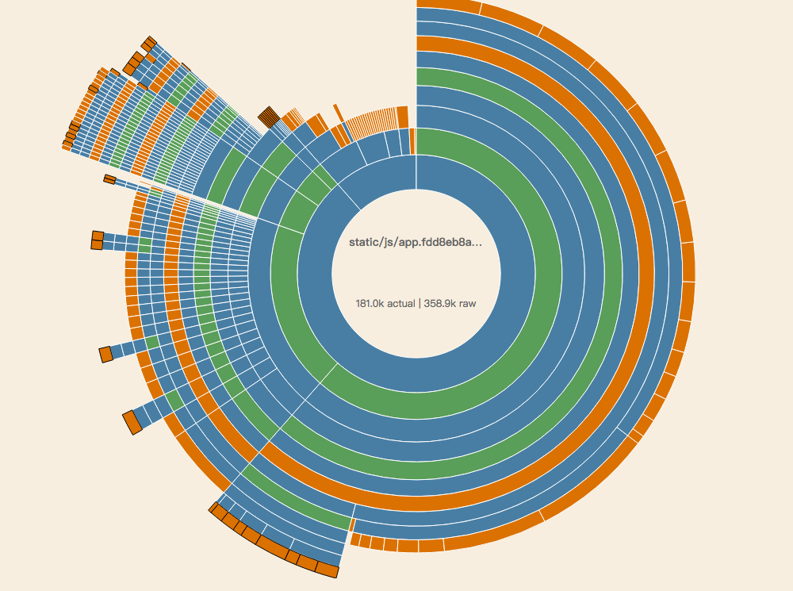

### 时间消耗分析
***
T(总) = T(依赖下载) + T(webpack构建)   
T(webpack构建) = T(loader) + T(plugins)


### webpack分析工具
***
* [在线分析网站](http://webpack.github.com/analyse)   

```
# 生成分析数据
webpack --profile --json > stats.json
```

* [webpack-visualizer](https://github.com/chrisbateman/webpack-visualizer)  

```
# 安装
npm install webpack-visualizer-plugin
```

```
# webpack.conf.js
var Visualizer = require('webpack-visualizer-plugin')
...
plugins: [new Visualizer()],
...
```

</img>

[example](demos/stats.html)


### T(依赖下载)
***
使用 [pnpm](https://github.com/pnpm/pnpm) 和 [npminstall](https://github.com/cnpm/npminstall) 加速依赖包下载    
使用最新版本 npm 和 npminstall 相比旧版本   
依赖安装时长可以达到原来的 **1/10**


### 项目开发习惯
***
* 业务变化快, 人员更替表频繁, 造成业务中并没有使用到 xx    
  要及时删除废弃依赖
```
import xx from 'xxx';
```
* 对lib进行按需引入
例如 echarts 项目中仅仅使用了部分图表, 可以只引入需要的模块
```
import xx from 'echarts/lib/echarts'; // 主模块
import xx from 'echarts/lib/bar';  // 柱状图
```
* 在组件中尽量不要引入大型css文件, 会造成重复打包
```
...
<style>
@import 'bootstrap/less/**';
</style>
...
```
* 尽可能不要引入未es5化的第三方库


### 引入webpack第三方优化插件
***
* css代码中引入第三方样式时, 由于第三方样式依赖很多css, 造成臃肿  
  tree-shaking特性


### loader
***
* css-loader 在0.14.5版本之后压缩耗时增加了几十倍, 目前尚未解决
* babel-loader可以缓存处理过的模块，对于没有修改过的文件不会再重新编译，     
  cacheDirectory 有着2倍以上的速度提升，这对于rebuild 有着非常大的性能提升。


### webpack自身
***
##### 1. _CommoonsChunkPlugin 打包共同依赖的代码, 防止重复打包_
1. 抽取所有模块公共部分
```javascript
webpackConfig.plugins.push( 
    new webpack.optimize.CommonsChunkPlugin('common', 'common.js')
)
```
2. 抽取指定重复引用模块
```
webpackConfig.plugins.push(
    new webpack.optimize.CommonsChunkPlugin({
        name: "commonOfAll",
        minChunks: 3
    })
)
```
3. 抽取指定分支的公共模块
```
webpackConfig.plugins.push(
    new webpack.optimize.CommonsChunkPlugin({
        name: "commonOfAB",
        chunks: ['entryA', 'entryB']
    })
)
```
4. 抽取指定的模块
```
webpackConfig.entry = {
    vendor: ['jquery']
}
webpackConfig.plugins.push(
    new CommonsChunkPlugin({
        name: "vendor",
        minChunks: Infinity,
    })
)
```
    

##### 2. _resolve.root vs resolve.modulesDirectories_
root 和 moduledirectories 从用法上来看可以互相替代, 但是由于
modulesDirectories是相对路径, 所以会比 root 多 parse 很多路径

```javascript
resolve: {
    root: path.resolve('src/node_modules'),
    extensions: ['', '.js', '.jsx']
},
resolve: {
    modulesDirectories: ['node_modules', './src'],
    extensions: ['', '.js', '.jsx']
},
```

在某个组件中引用a组件后

root 的解析路径
```javascript
./src/node_modules/a
```

modulesDirectories 的解析方式
```
/some/folder/structure/node_modules/a
/some/folder/structure/src/a
/some/folder/node_modules/a
/some/folder/src/a
/some/node_modules/a
/some/src/a
/node_modules/a
/src/a 
```


##### 3. _external: 把外部依赖通过 ```<script>``` 外链脚本引入_
html文件中引入库
```html
<html>
    ...
    <script src="../jquery.1.11.1.min.js"></script>
    ...
</html>
```
webpack.config.js 中配置 externals
```javascript
# webpack.config.js
module.exports = {
    ...
    externals: {
        'jquery': 'jQuery', // 值为全局变量, key为可以直接引用的包名
    }
    ...
}
```
把JS全局变量 映射到 指定字符串 'jquery', 在需要引用jquery的模块中
```vue
...
import $ from 'jquery';
...
```

可以有效减少打包体积, 提升打包速度, 节省构建时间, 缩小最终包的体积, cdn加速访问速度


##### 4. _alias 和 noParse_
如果某些第三方库没有必须打包入 bundle 中, 可以通过 noParse 让其跳过解析直接进入bundle 
```javascript
# webpack.config.js
module.exports = {
    ...
    resolve: {
        alias: {
            'vue': 'vue/dist/vue.min'
        }
    },
    noParse: [ 'vue' ]
    ...
};
```


##### 5. _[dllplugin](http://webpack.github.io/docs/list-of-plugins.html#dllplugin)_
deps 中也引用了大量的 npm 包，而这些包在正常的开发过程中并不会进行修改，但是在每一次
构建过程中却需要反复的将其分析，那么可以将这些依赖的包 一次性打包到本地, 直接外链.

dll.config.js
```
var path = require('path');
var webpack = require('webpack');

module.exports = {
    entry: {
        vendor: ['vue', 'vue-router']
    },
    output: {
        path: path.join(__dirname, 'dist'),
        filename: '[name].dll.js',
        /**
         * output.library
         * 将会定义为 window.${output.library}
         * 在这次的例子中，将会定义为`window.vendor_library`
         */
        library: '[name]_library'
    },
    plugins: [
        new webpack.DllPlugin({
            /**
             * path
             * 定义 manifest 文件生成的位置
             * [name]的部分由entry的名字替换
             */
            path: path.join(__dirname, 'dist', '[name]-manifest.json'),
            /**
             * name
             * dll bundle 输出到那个全局变量上
             * 和 output.library 一样即可。 
             */
            name: '[name]_library'
        })
    ]
};
```

生成 manifest.json 文件
```
{
    "name": "vendor_library",
    "content": {
        "./node_modules/process/browser.js": {
            "id": 0,
            "meta": {}
        },
        "./node_modules/vue-router/dist/vue-router.esm.js": {
            "id": 1,
            "meta": {
                "harmonyModule": true
            },
            "exports": [
                "default"
            ]
        },
        "./node_modules/vue/dist/vue.runtime.esm.js": {
            "id": 2,
            "meta": {
                "harmonyModule": true
            },
            "exports": [
                "default"
            ]
        },
        "./node_modules/webpack/buildin/global.js": {
            "id": 3,
            "meta": {}
        }
    }
}
```

webpack.config.js
```
var path = require('path');
var webpack = require('webpack');

module.exports = {
    entry: {
        'dll-user': ['./index.js']
    },
    output: {
        path: path.join(__dirname, 'dist'),
        filename: '[name].bundle.js'
    },
    // ----在这里追加----
    plugins: [
        new webpack.DllReferencePlugin({
            context: __dirname,
            /**
             * 在这里引入 manifest 文件
             */
            manifest: require('./dist/vendor-manifest.json')
        })
    ]
    // ----在这里追加----
};
```


##### 6. _(happypack)[https://github.com/amireh/happypack] 多进程运行 loader & plugin_
```
# webpack.config.js
module.exports = {
    ...
    module: {
        rules: {
            test: /.js$/,
            loaders: [ 'happypack/loader?id=js' ],
            include: [resolve('src'), resolve('test'), resolve('node_modules/iview') ],
        },
        {
            test: /\.vue$/,
            loaders: [ 'happypack/loader?id=vue' ],
            // options: vueLoaderConfig,
            include: [resolve('src'), resolve('test'), resolve('node_modules/iview') ],
        },
    },
    ...
    plugins: [
        new HappyPack({
            id: 'js',
            threadPool: happyThreadPool,
            loaders: [ 'babel-loader' ]
        }),
        new HappyPack({
            id: 'vue',
            threadPool: happyThreadPool,
            loaders: [ 'vue-loader' ]
        })
    ]
    ...
}
```
##### 7. _webpack-uglify-parallel 代替 UglifyJsPlugin 多核并行压缩_
webpack提供的UglifyJS插件由于采用单线程压缩，速度很慢
webpack-parallel-uglify-plugin插件可以并行运行UglifyJS插件，这可以有效减少构建时间
##### 8. _打开缓存使用 增量构建(cacheDirectory)_
```
# webpack.config.js
module.exports = {
    module: {
        {
            test: /\.ejs$/,
            loader: 'babel-loader?cacheDirectory',
            query: {compact: false}
        },
    },
}
```


